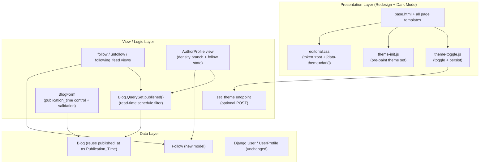
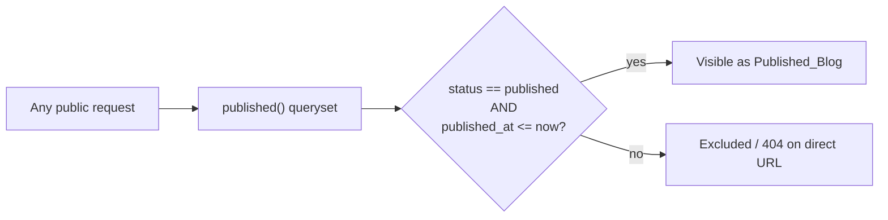
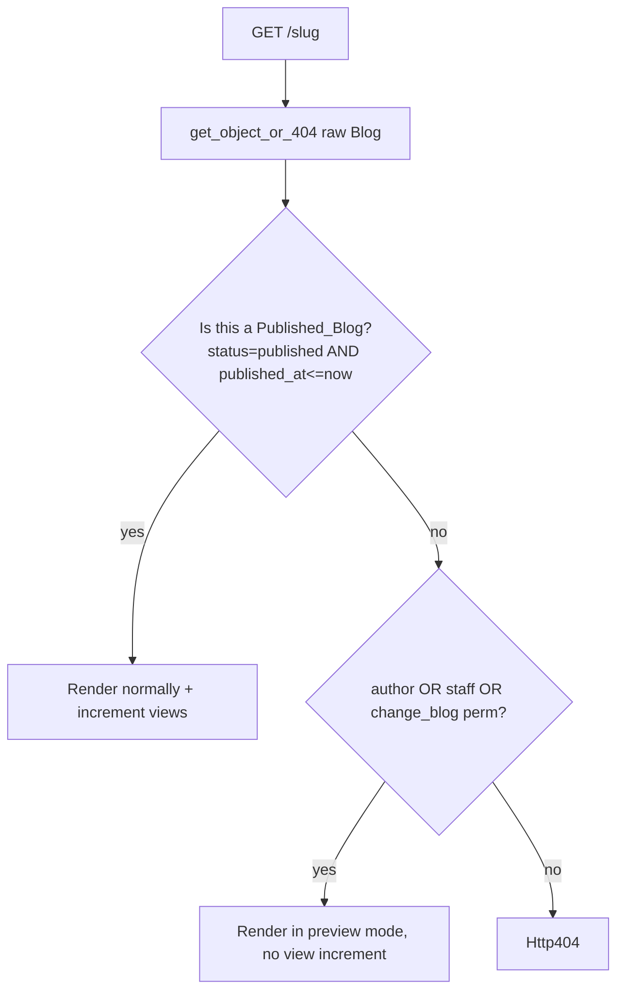
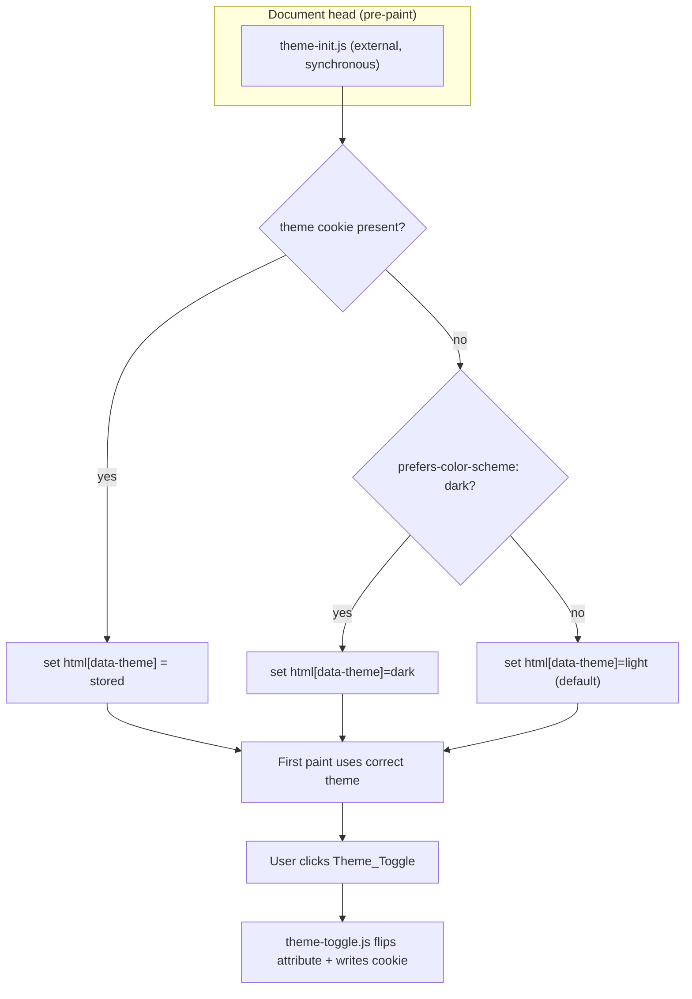
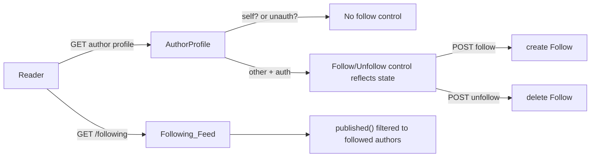
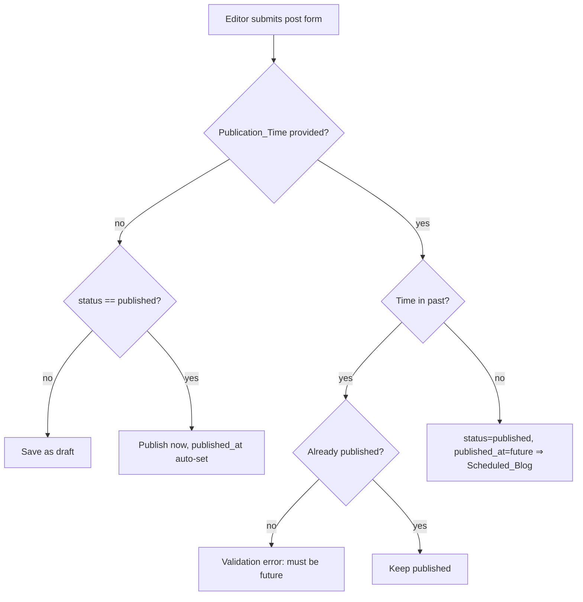

# Design Document

## Overview

The Editorial Revamp feature bundles three coordinated changes to the InkSpire Django platform:

1. **Modern Editorial redesign** — a full visual overhaul of every public and dashboard template driven by a new token-based Design System, plus a first-class dark mode.
2. **Follow Authors** — a new `Follow` relationship model, follow/unfollow controls on author profiles, and a personalized "Following Feed."
3. **Scheduled Publishing** — the ability to schedule a `Blog` to go live at a future time using a purely read-time queryset filter, with no background task runner.

The guiding constraint across all three is **minimal new infrastructure**. Scheduling reuses the existing `Blog.objects.published()` queryset and the existing `published_at` field. Theme persistence uses cookies/session rather than a new preference model. Follow behavior operates against the existing Django `User` model. No Celery, cron, message queue, new role concept, or separate `Author` model is introduced (Requirements 10.4, 14.1, 14.2, 14.3).

The design is organized so that the three concerns are largely independent and can be implemented and reviewed in isolation:

- The **redesign** is almost entirely a presentation-layer concern (CSS tokens, templates, a small theme-toggle script). It touches views only where a view must branch presentation (e.g., density-optimized author profile for editors).
- **Follow** adds one model, one migration, one view module, one URL group, and profile-page template changes.
- **Scheduling** changes the `published()` queryset semantics, the dashboard `BlogForm`, and the dashboard post-list template. Because every public surface already funnels through `Blog.objects.published()`, changing that one queryset propagates scheduling visibility to the homepage, archives, search, author profiles, sitemap, RSS, and detail view automatically.

### Research Notes and Key Findings

- **Every public listing already routes through `Blog.objects.published()`.** `home()`, `Posts_by_category()`, `Search()`, `AuthorProfile()`, `BlogDetail()` related posts, `BlogSitemap.items()`, and `LatestPostsFeed.items()` all call `.published()`. This means scheduled-content exclusion (Requirement 11) can be implemented at a single choke point: redefine what `published()` returns. This is the lowest-risk way to satisfy 11.1–11.4 consistently. (Source: `blogs/views.py`, `blog_main/feeds.py`, `blog_main/sitemaps.py`.)
- **`published_at` already exists and is auto-set on publish.** `Blog.save()` sets `published_at = timezone.now()` when status becomes `published` and it is not already set. We can reuse `published_at` as the Publication_Time carrier: a row with `status='published'` and a future `published_at` is a Scheduled_Blog. This avoids adding a redundant field and satisfies 10.1/10.5. (Source: `blogs/models.py`.)
- **Draft-preview permission logic already exists in `BlogDetail`.** The check `post.author_id == request.user.id or is_staff or has_perm('blogs.change_blog')` gates preview. Extending it to scheduled posts (Requirement 11.6) is a matter of broadening the `is_preview` condition, not adding a new permission. (Source: `blogs/views.py`.)
- **Production CSP forbids inline scripts.** `script-src 'self' https://cdn.jsdelivr.net` has no `'unsafe-inline'`. Therefore the dark-mode flash-prevention script **must be an external static file** loaded synchronously in `<head>`, not an inline `<script>`. This is a hard constraint on the theme design. (Source: `blog_main/settings_prod.py`.)
- **Sessions are already configured** (`SESSION_COOKIE_AGE = 1209600`, 2 weeks). Theme preference can piggyback on the session cookie or a dedicated long-lived cookie without new infrastructure (Requirement 14.2). (Source: `blog_main/settings_prod.py`.)
- **A design token spec already exists** in `FRONTEND_V2_DESIGN_SYSTEM.md` and closely matches Requirement 1 (warm off-white background, near-black text, single warm rust accent `#B5651D`, 6px max radius, hairline borders, no gradients/glassmorphism). The Modern Editorial system extends this doc by adding dark-theme token values and asymmetric-layout component patterns. We adopt it as the light-theme baseline rather than inventing new values.

## Architecture

### Layered View of the Change



### Scheduling: Read-Time Filter Choke Point

Scheduling is implemented by redefining the single `published()` queryset method. Today:

```python
def published(self):
    return self.filter(status='published')
```

New behavior treats a row as publicly published only when its status is `published` **and** its effective publication time is at or before "now":

```python
def published(self):
    return self.filter(
        status='published',
    ).filter(
        models.Q(published_at__isnull=True) | models.Q(published_at__lte=timezone.now())
    )
```

Because every Public_Surface funnels through `published()`, this one change enforces Requirements 11.1–11.4 without touching individual views, the sitemap, or the feed. The comparison is evaluated per-request against `timezone.now()`, so a Scheduled_Blog becomes visible automatically on its next read once its time passes (Requirement 10.3) — no task runner (Requirements 10.4, 14.1).



### Scheduling: Detail-View Preview Path

`BlogDetail` must continue to serve draft previews to authorized users and now must also serve scheduled previews to those same authorized users (Requirement 11.6), while returning 404 to everyone else (Requirement 11.5). The detail view fetches the raw `Blog` (not the `published()` queryset), then computes visibility:



The existing view-count rule is preserved: increment exactly once per non-preview request (Requirement 13.1). Scheduled and draft previews are both non-incrementing because both set `is_preview = True`.

### Dark Mode Architecture

Dark mode is CSS-variable driven. Tokens are declared on `:root` for light and overridden under a `[data-theme="dark"]` attribute selector on `<html>`. Switching theme = flipping one attribute; the browser recomputes variable-derived colors with a scoped transition. No page navigation required (Requirement 2.2).



**Flash prevention under CSP:** `theme-init.js` is served from `` (origin `'self'`, allowed by CSP) and included in `<head>` **before** the stylesheet's paint so the correct `data-theme` is set before first paint. Because CSP blocks inline scripts, we cannot use the common inline-script trick; the external synchronous script is the CSP-compatible equivalent.

**Persistence (Requirement 2.3, 14.2):** the toggle writes a long-lived cookie (e.g., `theme`, `Max-Age` ≈ 1 year, `SameSite=Lax`, not `HttpOnly` because JS must read it). Cookie storage is chosen over a DB preference model per Requirement 14.2; it works for both Visitors and Readers without authentication. An optional `set_theme` POST endpoint can mirror the value into the session for server-side rendering of the correct `data-theme` on the very first byte, but the cookie alone is sufficient and is the primary mechanism.

**System preference + default (Requirement 2.4):** when no cookie exists, `theme-init.js` reads `window.matchMedia('(prefers-color-scheme: dark)')` and falls back to light when unavailable.

**Transition safety (Requirement 2.5):** color transitions are applied via a CSS `transition` on background/text color. The toggle script feature-detects transition support; if transitions are unavailable, the script does not apply the theme change rather than performing an instantaneous flash-switch (satisfying the "SHALL NOT complete the change" clause).

### Follow Architecture



Follow endpoints are POST-only and `@login_required` (redirecting unauthenticated submissions to login per Requirements 7.5, 8.3). Uniqueness and self-follow prevention are enforced at both the DB (constraints) and application (validation) layers (Requirement 6).

## Components and Interfaces

### 1. Design System / CSS (`static/css/editorial.css`)

Replaces reliance on `blog.css` + Bootstrap utility classes with a token-driven stylesheet. Structure:

- `:root { ... }` — light-theme tokens (color, type, spacing, radius, shadow, motion) adopted from `FRONTEND_V2_DESIGN_SYSTEM.md`.
- `:root[data-theme="dark"] { ... }` — dark-theme overrides: near-black backgrounds, warm off-white text, **same** accent `#B5651D` (Requirement 1.2).
- Component classes: `.hero`, `.post-grid` (asymmetric), `.post-card`, `.category-tag`, `.empty-state`, `.reading-progress`, `.data-table` (dashboard density), `.btn-*`, form controls, alerts, status pills.

Interface contract (what templates depend on):

| Class / token | Requirement | Contract |
|---|---|---|
| `--color-accent` identical in both themes | 1.2 | Dark theme reuses the light accent value |
| `--radius-md: 6px`, no radius > 8px on rectangles | 1.4 | Max rectangular radius |
| `.post-card`, `.panel`, `.section` use `1px` border | 1.5 | Hairline separation, not shadow |
| No `linear-gradient`/`backdrop-filter` in file except over `` overlays | 1.6, 1.7 | Flat fills only |
| `.post-grid--asymmetric` | 3.2 | Mixed-size grid |
| `.reading-progress` | 4.4 | Sole scroll-driven element |
| `[data-theme]` transition on bg/text color | 2.5 | Smooth theme change |

### 2. Theme scripts

- `static/js/theme-init.js` — runs synchronously in `<head>`; sets `document.documentElement.dataset.theme` from cookie → system preference → light. No dependencies.
- `static/js/theme-toggle.js` — deferred; wires the `Theme_Toggle` button, flips `data-theme`, persists cookie, guards on transition support (Requirement 2.5).

Both are origin-local (CSP-safe). Added to `base.html`.

### 3. `Blog.QuerySet.published()` (modified) — `blogs/models.py`

```python
class QuerySet(models.QuerySet):
    def published(self):
        return self.filter(status='published').filter(
            Q(published_at__isnull=True) | Q(published_at__lte=timezone.now())
        )

    def scheduled(self):
        return self.filter(status='published', published_at__gt=timezone.now())
```

- `published()` now excludes future-dated rows (Requirements 10.2, 10.4, 11.1–11.4).
- `scheduled()` is a helper for the dashboard listing (Requirement 12.5).
- No new field: a Scheduled_Blog is `status='published'` with a future `published_at`. `Blog.save()` already records `published_at` on publish and is unchanged for the immediate-publish path (Requirement 10.5).

### 4. `BlogDetail` view (modified) — `blogs/views.py`

Visibility computed against the same rule as `published()`:

```python
now = timezone.now()
is_public = post.status == 'published' and (post.published_at is None or post.published_at <= now)
is_preview = not is_public
can_preview = request.user.is_authenticated and (
    post.author_id == request.user.id or request.user.is_staff
    or request.user.has_perm('blogs.change_blog')
)
if is_preview and not can_preview:
    raise Http404
```

View-count increment stays gated on `not is_preview` (Requirement 13.1). Existing `select_related`/comment prefetch logic is untouched (Requirement 13.2).

### 5. Follow views — new `blogs` views + URLs

| View | Method | Auth | Behavior |
|---|---|---|---|
| `follow_author(username)` | POST | required | Create Follow (Reader→Author); reject self-follow; idempotent via `get_or_create`; redirect back to profile (Req 7.3, 6.3) |
| `unfollow_author(username)` | POST | required | Delete Follow if present; redirect back (Req 7.4) |
| `following_feed()` | GET | required | List `published()` posts by followed authors, newest first; empty state when none (Req 8.1, 8.4) |

Unauthenticated POST/GET is redirected to login by `@login_required` (Requirements 7.5, 8.3).

`following_feed` query (Requirement 8.1 — filter at query level, ordered, optimized per 13.2):

```python
followed_ids = Follow.objects.filter(follower=request.user).values('followed_id')
posts = Blog.objects.published().filter(
    author_id__in=followed_ids
).select_related('author', 'category').order_by('-published_at', '-created_at')
```

### 6. `AuthorProfile` view (modified) — `blogs/views.py`

Adds follow-state context and density branching:

- `is_following` — whether `request.user` follows `author` (only computed when authenticated and not viewing self) → drives which control shows (Requirements 7.1, 7.2, 7.6).
- `show_follow_control` — `request.user.is_authenticated and request.user != author`.
- `follower_count` — `Follow.objects.filter(followed=author).count()`, rendered where enabled (Requirement 9.1).
- Density selection (Requirements 5.5, 5.6): a viewer with Editor permissions gets the density-optimized presentation; a Visitor or non-Editor Reader gets the spacious presentation. Implemented by passing a `use_dashboard_density` flag (`request.user.is_authenticated and (is_staff or has_perm('blogs.change_blog'))`) that selects a template variant / body class.
- Public post listing continues to use `published()`, so scheduled posts are excluded (Requirement 11.1).

### 7. Dashboard `BlogForm` (modified) — `dashboard/forms.py`

Adds a `publication_time` control bound to the model's `published_at` field (Requirements 12.1, 12.2) with a `datetime-local` widget, plus validation:

- **Past time rejected for not-yet-published posts** (Requirement 12.3): if a Publication_Time is in the past and the post is not already published, raise a validation error naming the future-time requirement.
- **Clearing schedule → draft** (Requirement 12.4): if the editor clears the Publication_Time and does not set status to `published`, save as `draft` (avoid ambiguous scheduled state).
- Existing image-upload validation and sanitizer mixin remain (Requirements 13.5).



### 8. Dashboard post-list template (modified) — `templates/dashboard/posts.html`

Visually distinguishes three states — draft, scheduled, published — via status pills, showing the Publication_Time for scheduled posts (Requirement 12.5). Uses `Blog.objects.scheduled()` semantics to classify each row (a published-status row with future `published_at` renders as "Scheduled").

### 9. Templates (redesign) — all under `templates/`

Every template extending `base.html` is restyled under the Design System (Requirement 5.1) while preserving SEO blocks already present in `base.html` (canonical, OG, Twitter, JSON-LD) with no functional regression (Requirements 5.2, 13.7). Bootstrap-utility layouts are replaced with Design-System equivalents (Requirement 5.3). A `Theme_Toggle` control is added to the header. Homepage gets hero + asymmetric grid + category tags + featured empty state (Requirement 3).

## Data Models

### New: `Follow` model (`blogs/models.py`)

```python
class Follow(models.Model):
    follower = models.ForeignKey(
        User, on_delete=models.CASCADE, related_name='following')
    followed = models.ForeignKey(
        User, on_delete=models.CASCADE, related_name='followers')
    created_at = models.DateTimeField(auto_now_add=True)

    class Meta:
        constraints = [
            models.UniqueConstraint(
                fields=['follower', 'followed'], name='unique_follow'),
            models.CheckConstraint(
                check=~models.Q(follower=models.F('followed')),
                name='prevent_self_follow'),
        ]
        indexes = [
            models.Index(fields=['follower', 'followed']),
            models.Index(fields=['followed']),
        ]

    def __str__(self):
        return f'{self.follower.username} follows {self.followed.username}'
```

- `on_delete=CASCADE` on both FKs satisfies Requirement 6.4 (deleting a User removes Follow rows where they are follower or followed).
- `UniqueConstraint` satisfies Requirement 6.2.
- `CheckConstraint` satisfies Requirement 6.3 at the DB layer; application-level validation (in the follow view / a `clean()` method) provides a friendly rejection path.
- Operates entirely on the existing `User` model — no `Author` model introduced (Requirement 14.3).

### Reused: `Blog.published_at` as Publication_Time

No schema change to `Blog`. Semantics:

| status | published_at | Interpretation |
|---|---|---|
| `draft` | any | Draft (never public) |
| `published` | null or `<= now` | Published_Blog (public) |
| `published` | `> now` | Scheduled_Blog (hidden until time passes) |

This satisfies Requirements 10.1, 10.2, 10.5 without a migration to add fields. (A data migration is unnecessary; existing published rows have `published_at <= now` and remain visible.)

### Unchanged: `User`, `UserProfile`

No new preference model for theme (Requirement 14.2); no new role/permission types (Requirements 13.8, 14.3).

## Correctness Properties

*A property is a characteristic or behavior that should hold true across all valid executions of a system — essentially, a formal statement about what the system should do. Properties serve as the bridge between human-readable specifications and machine-verifiable correctness guarantees.*

The properties below cover the **behavioral logic** of this feature — the scheduling read-time filter, the Follow relationship rules, the Following Feed query, the preview-access gate, view-count behavior, and content-rendering invariants. They do **not** cover the visual/token layer of the redesign (colors, radii, typography, layout aesthetics, motion feel), which is covered by stylesheet audits, snapshot tests, and design review as described in the Testing Strategy. The properties below were derived from the prework analysis after consolidating redundant criteria.

### Property 1: Category tag is rendered on post treatments

*For any* published post that has an assigned Category, rendering that post's homepage card or hero treatment produces output containing a distinguishable category tag labeled with that Category.

**Validates: Requirements 3.3**

### Property 2: Reading-progress reflects scroll position

*For any* scroll offset within the article body's scrollable range `[0, max]`, the computed reading-progress value is within `[0, 100]`, equals `0` at the top and `100` at the bottom, and is monotonically non-decreasing as the scroll offset increases.

**Validates: Requirements 4.4**

### Property 3: SEO metadata is preserved for every published post

*For any* published post, the rendered article detail page contains each of the following metadata elements, verified individually: canonical URL, Open Graph tags, Twitter Card tags, and JSON-LD structured data (where JSON-LD is present).

**Validates: Requirements 5.2, 13.7**

### Property 4: Author-profile presentation is selected by Editor permission

*For any* viewer of an Author Profile Page, the page renders using the density-optimized Dashboard presentation if and only if the viewer holds Editor permission (staff or `blogs.change_blog`); every viewer without Editor permission (including Visitors) receives the spacious public presentation.

**Validates: Requirements 5.5, 5.6**

### Property 5: Following is unique and idempotent

*For any* pair of distinct Users (follower, followed), performing the follow action one or more times results in exactly one Follow record for that pair.

**Validates: Requirements 6.2, 7.3**

### Property 6: Self-follow is rejected

*For any* User, attempting to follow themselves creates no Follow record and the attempt is rejected.

**Validates: Requirements 6.3**

### Property 7: Deleting a User removes all Follow edges touching them

*For any* follow graph, after deleting a User, no Follow record remains that references that User as either follower or followed.

**Validates: Requirements 6.4**

### Property 8: Displayed control reflects follow state

*For any* authenticated viewer looking at another User's Author Profile Page, the page displays the unfollow control when a Follow record from viewer to author exists, and the follow control when it does not.

**Validates: Requirements 7.1, 7.2**

### Property 9: Follow then unfollow round-trips to the original state

*For any* authenticated viewer and distinct author, performing a follow action followed by an unfollow action leaves no Follow record between them, returning the relationship to its original unfollowed state.

**Validates: Requirements 7.4**

### Property 10: Anonymous follow/unfollow is a no-op redirect

*For any* follow or unfollow submission made by an unauthenticated Visitor, the response redirects to the login page and the set of Follow records is unchanged.

**Validates: Requirements 7.5**

### Property 11: No follow control on one's own profile

*For any* User viewing their own Author Profile Page, neither a follow nor an unfollow control is present.

**Validates: Requirements 7.6**

### Property 12: Following Feed contains exactly published-due posts by followed authors

*For any* set of Users, follow relationships, and posts, the Following Feed for a given Reader contains exactly those posts that are Published_Blog posts (status published and Publication_Time at or before now) authored by Users the Reader follows, ordered most-recently-published first — and contains no post authored by a non-followed User and no unpublished or not-yet-due Scheduled_Blog post.

**Validates: Requirements 8.1, 8.2, 11.4**

### Property 13: Follower count matches Follow records

*For any* follow graph, the follower count displayed for an Author equals the number of Follow records in which that Author is the followed User.

**Validates: Requirements 9.1**

### Property 14: Publication visibility is a read-time comparison

*For any* Blog and any evaluation time `t`, the Blog is included in `Blog.objects.published()` (and thus visible on every Public_Surface) if and only if its status is `published` and its Publication_Time (`published_at`) is null or at or before `t`; a Blog with a future Publication_Time is excluded at time `t` and becomes included at any later evaluation time past its Publication_Time, with no intervening write.

**Validates: Requirements 10.2, 10.3, 11.1**

### Property 15: Direct publish records publication time once

*For any* Blog saved with status `published` and no existing `published_at`, the save sets `published_at` to the current time; *for any* Blog that already has a `published_at`, saving does not overwrite it.

**Validates: Requirements 10.5**

### Property 16: Preview access to non-public posts is permission-gated

*For any* non-public post (a draft, or a Scheduled_Blog whose Publication_Time has not passed) and *any* requester, the article detail page is viewable if and only if the requester is the post's author, is staff, or holds `blogs.change_blog`; every other requester (including Visitors) receives a 404 as if the post does not exist.

**Validates: Requirements 11.5, 11.6, 13.3**

### Property 17: Past publication times are rejected before publish

*For any* Publication_Time in the past submitted for a Blog that is not already published, the dashboard form is invalid and reports a message requiring a future time; *for any* Publication_Time in the future, the form accepts the value.

**Validates: Requirements 12.3**

### Property 18: Dashboard listing classifies each post by its true state

*For any* Blog, the dashboard post listing labels it as `draft`, `scheduled`, or `published` matching its actual state (draft when status is draft; scheduled when status is published with a future `published_at`; published otherwise), and shows the Publication_Time for scheduled posts.

**Validates: Requirements 12.5**

### Property 19: View count increments once per non-preview read

*For any* Published_Blog, issuing `N` non-preview article detail requests increases its view count by exactly `N`, while any preview request (draft or scheduled, by an authorized previewer) increases it by `0`, regardless of scheduling.

**Validates: Requirements 13.1**

## Error Handling

### Scheduling

- **Past publication time on a not-yet-published post** — rejected at the form layer (`BlogForm.clean`) with a field/non-field validation message naming the future-time requirement (Requirement 12.3). The model is not saved.
- **Cleared publication time without publish** — normalized to a `draft` save rather than an ambiguous state (Requirement 12.4).
- **Direct URL access to a Scheduled_Blog** by an unauthorized requester — `Http404`, identical to existing draft handling, so scheduled content is indistinguishable from nonexistent content (Requirement 11.5).
- **Time-zone correctness** — all comparisons use `timezone.now()` (project uses tz-aware datetimes); `published_at` is stored tz-aware so the read-time filter is unambiguous around the boundary.

### Follow

- **Duplicate follow** — handled with `get_or_create`, so a repeat follow is idempotent and never raises to the user; the DB `UniqueConstraint` is the backstop (Requirements 6.2, 7.3).
- **Self-follow** — rejected in the view (guard) and by the DB `CheckConstraint`; the view redirects back with no record created (Requirement 6.3). An `IntegrityError` from a race is caught and treated as a no-op.
- **Unfollow when no record exists** — treated as a no-op (the delete simply affects zero rows); page renders the unfollowed state (Requirement 7.4).
- **Unauthenticated submission** — `@login_required` redirects to the login page before any data mutation (Requirements 7.5, 8.3).
- **Following feed with no follows** — renders a named empty-state, not an error or blank page (Requirement 8.4).

### Theme

- **Missing/unreadable cookie** — `theme-init.js` falls back to system preference, then to light (Requirement 2.4). Malformed cookie values are treated as "no preference."
- **Transition unsupported** — the toggle does not apply an instantaneous switch; it declines to complete the change rather than flashing (Requirement 2.5).
- **CSP** — theme scripts are origin-local static files; no inline script is used, so no CSP relaxation is required.

### Redesign / templates

- **Missing featured post** — homepage renders a named empty-state instead of a hero, even when non-featured posts exist (Requirement 3.4).
- **SEO regression guard** — metadata blocks remain in `base.html`/detail templates; tests assert each block individually to catch accidental removal during restyling (Requirements 5.2, 13.7).

## Testing Strategy

### Property-Based Tests (behavioral logic)

Properties 1–19 are implemented with a property-based testing library. For Python/Django the target library is **Hypothesis** (with `hypothesis.extra.django` for model strategies and `HypothesisTestCase` for transactional DB tests). We do **not** hand-roll randomized testing.

Rules:
- Each property test runs a **minimum of 100 iterations** (Hypothesis `max_examples=100` or higher).
- Each property test is tagged with a comment referencing its design property in the form:
  `# Feature: editorial-revamp, Property {number}: {property_text}`
- Each correctness property is implemented by a **single** property-based test.
- Generators cover edge cases explicitly: empty follow graphs, self-pairs (for rejection), publication times exactly at `now`, unicode titles/usernames, posts with and without categories, and viewers across the permission matrix (anonymous / plain reader / author / staff / `change_blog` holder).

Notable generator/oracle notes:
- **Property 14 (read-time filter)** and **Property 19 (view count)** parametrize the evaluation time and freeze/inject `now` (e.g., via `freezegun` or an injected clock) so boundary times (`published_at == now`, `published_at == now ± ε`) are exercised deterministically.
- **Property 12 (Following Feed)** uses a model-based oracle: build the expected set with a plain Python filter/sort over generated data and assert equality with the view's queryset result.
- **Property 2 (reading progress)** tests the pure scroll→progress function directly (extracted from `theme`/progress JS logic or its Python/JS unit under a JS test runner) over random offsets; monotonicity is checked pairwise on sorted offsets.
- **Properties 1, 3, 4, 8, 18** render templates/views and assert on rendered HTML content (presence of category tag, metadata blocks, presentation variant marker, correct control, correct status label).

### Example-Based and Edge-Case Unit Tests

- Theme initialization branches (2.4): mocked `matchMedia` → dark / light / unsupported.
- Theme persistence round-trip (2.3) and toggle-without-navigation (2.2): DOM/browser test.
- Transition-unsupported fallback (2.5): stubbed feature detection.
- Homepage hero present with featured posts (3.1) and empty-state with none (3.4).
- Following feed: anonymous redirect (8.3) and empty-state for no follows (8.4).
- Sitemap excludes scheduled (11.2) and RSS excludes scheduled (11.3) — 1–2 representative examples each.
- Clearing schedule saves as draft (12.4).
- Query-count regression (13.2): `assertNumQueries` on listing/detail views held constant as row count grows (no N+1 from scheduling or follow additions).
- Preservation regressions (13.4, 13.5, 13.6): existing rate-limit, image-validation, and comment/like/bookmark test suites continue to pass unchanged.

### Stylesheet / Snapshot / Audit Checks (visual layer — no PBT)

The visual token and layout requirements are verified without property-based testing:
- **Token snapshots / assertions** (1.1, 1.2, 1.3): assert compiled CSS custom properties, including that the dark accent equals the light accent, and that exactly one serif + one sans family are declared.
- **Stylesheet audits** (1.4, 1.5, 1.6, 1.7, 4.1, 4.2, 4.3, 4.5): scan `editorial.css`/templates for radius > 8px on rectangular selectors, gradient/`backdrop-filter` usage outside image overlays, decorative assets, and disallowed load/scroll animations.
- **Contrast enumeration** (1.8): compute the WCAG contrast ratio for every documented text/background token pair in both themes and assert each meets its threshold (4.5:1 body, 3:1 large/UI).
- **Coverage smoke** (2.1, 5.1, 5.3, 5.4): render every page in both themes and assert it extends the themed base and renders without depending on removed Bootstrap utility classes; confirm dashboard uses the density component set.

### Structural / Smoke Checks

- Follow model + fields + migration exist (6.1); dashboard forms expose the publication-time control (12.1, 12.2).
- Architecture constraints (10.4, 14.1, 14.2, 14.3): confirm no Celery/cron/queue dependency, theme persisted via cookie/session (no new preference model), Follow/scheduling reference the existing `User` model (no `Author` model), and no new roles/permission types (13.8).

### Test Configuration Summary

| Category | Tooling | Iterations | Tag |
|---|---|---|---|
| Property tests (P1–P19) | Hypothesis + `hypothesis.extra.django` | ≥ 100 each | `# Feature: editorial-revamp, Property {n}: ...` |
| Example/edge unit tests | Django `TestCase` / client | n/a | — |
| JS behavior (theme, progress) | JS test runner (e.g., Vitest/Jest) or Django + Selenium where DOM needed | n/a | — |
| Stylesheet audits / contrast | CSS-parsing script + contrast calc | enumerated | — |
| Query-count regression | `assertNumQueries` | n/a | — |
